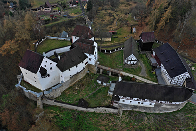
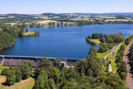
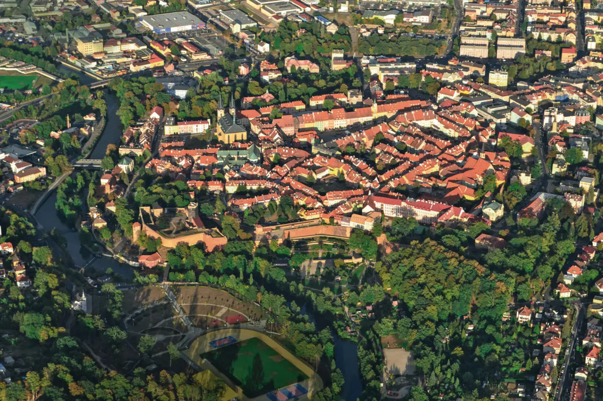
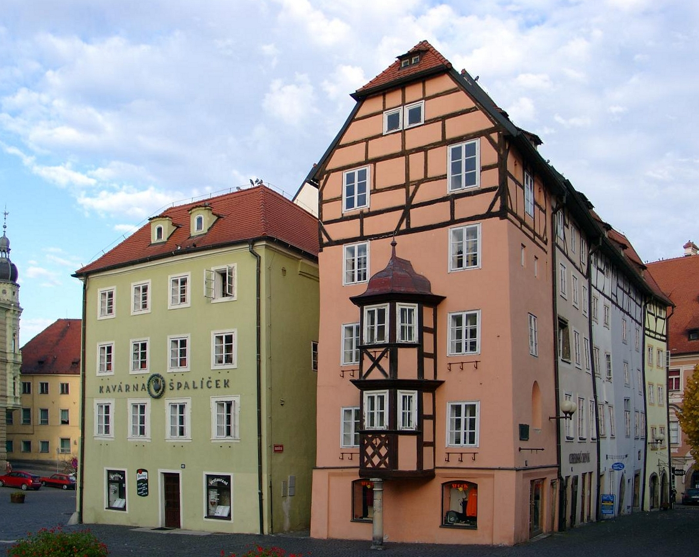

[zurück](../CZ.md)

# Eger (Cheb)

| Transport | Dauer | Kosten |
|-----------|--------|---------|
| Auto      | ca. 6 Std. (550 km via Süddeutschland/Österreich) | Maut DE: keine / Maut CZ: ca. CHF 15 (10-Tage) |
| Zug       | ca. 8-10 Std. | ca. CHF 80-100 |

### Unterkunftskosten (3-5 Tage)
- **Günstige Gasthäuser:** ab ca. CHF 40/Nacht  
- **Mittelklasse-Hotels:** ab ca. CHF 60/Nacht

### Kulinarische Empfehlungen
- Böhmische Küche in traditionellen Gasthäusern
- Lokale Biere

### Reisezeitempfehlung
- **Frühling/Sommer:** Ideal für Outdoor-Aktivitäten, Wandern und Thermen
- **Herbst:** Milder Tourismus, herbstliche Landschaft
- **Winter:** Weniger Touristen, Weihnachtsatmosphäre, warmes Thermalbad

---

# Aktivitäten

## Ganzjährig
- **Historische Altstadt von Cheb:** Spaziergang, Fachwerkhäuser, Marktplatz mit "Stöckl" (gotische Häuserreihe)  
- **Cheb Burg (Egerburg):** Eintritt ca. CHF 5-8, romanische Kapelle und Palas  
- **Franzensbad (Františkovy Lázně):** Ca. 15 Min. Fahrt, Kurort mit Thermalquellen, Thermeneintritt ab ca. CHF 15-20  
- **Sowjetisches Ehrenmal in Cheb:** Kurzer Fußweg, kostenlos  
- **Burg Loket:** Ca. 1 Std. Fahrt, mittelalterliche Burg, Eintritt ca. CHF 10  
- **Karlovy Vary (Karlsbad):** Ca. 50 Min. Autofahrt, berühmter Kurort mit heißen Quellen  
- **Sowjetisches Ehrenmal in Karlovy Vary:** Ca. 50 Min. Autofahrt, sowjetisches Denkmal & Soldatenfriedhof, gepflegte Parkanlagen

## Sommeraktivitäten
- **Wandern im Egerland:** Beschilderte Wege rund um Cheb  
- **Baden im Stausee Jesenice:** Ca. 10-15 Min. Autofahrt, Angeln möglich

## Winteraktivitäten
- **Weihnachtsmarkt in Cheb (Dezember):** Kostenloser Eintritt, regionale Spezialitäten  
- **Museum:** Regionalmuseum Cheb, Eintritt ca. CHF 5

## Wanderungen in der Region

### Wanderung nach Seeberg (Ostroh)
**Beschreibung:**  
Von Cheb aus kann man zur Burg Seeberg wandern. Der Weg führt durch ländliche Gebiete, vorbei an Feldern und kleinen Dörfern.

**Länge & Dauer:**  
Ca. 6-8 km einfache Strecke, insgesamt rund 12-16 km Hin- und Rückweg. Dauer: 3-5 Stunden je nach Tempo.

**Highlights:**  
Historische Burg Seeberg, schöne Ausblicke auf die Landschaft Westböhmens. Die Burg kann gegen Eintritt besichtigt werden.

### Wanderung zum Stausee Jesenice
**Beschreibung:**  
Ein gut beschilderter Weg führt vom Stadtrand Chebs zum nahegelegenen Stausee Jesenice. Die Strecke ist leicht hügelig und verläuft durch Wälder, Wiesen und kleine Dörfer.

**Länge & Dauer:**  
Je nach Startpunkt in Cheb ca. 16-20 km, 4-6 Stunden Gehzeit.

**Highlights:**  
Schöne Ausblicke auf den See, Wasservögel und ruhige Waldwege. 

---

# Fotos

**Altstadt**  

**Luftbild**  

**Chebburg**  

**Stöckl**  

**Kaiserpfalz**  

