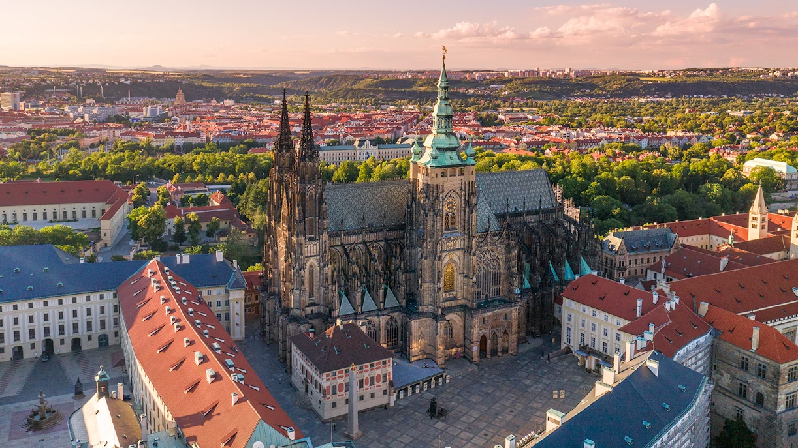

[zurück](../CZ.md)

# Prag

| Transport | Dauer | Kosten |
|-----------|--------|---------|
| Auto      | ca. 7-8 Std. (ca. 700 km via DE/AT) | Maut AT: ca. CHF 10 (10-Tage), Maut CZ: ca. CHF 15 (10-Tage) |
| Zug       | ca. 9-10 Std. | ca. CHF 90-120 |

### Unterkunftskosten (3-5 Tage)
- **Günstige Hostels/Pensionen:** ab ca. CHF 40/Nacht  
- **Mittelklasse-Hotels:** ab ca. CHF 70/Nacht

### Kulinarische Empfehlungen
- Böhmische Küche (z. B. Gulasch, Knödel, Schweinebraten) in traditionellen Wirtshäusern  
- Lokale Biere (Pilsener Urquell, Budvar)  
- Süßes Gebäck (Trdelník) in der Altstadt

### Reisezeitempfehlung
- **Frühling/Herbst:** Angenehme Temperaturen, weniger Touristen, ideal für historische Rundgänge  
- **Sommer:** Viele Open-Air-Events, aber mehr Touristen  
- **Winter:** Weihnachtsmärkte, weniger Besucher, romantische Altstadt-Atmosphäre

---

# Aktivitäten

## Historische Sehenswürdigkeiten
- **Prager Burg (Pražský hrad):**  
  Europas größtes Burgareal mit Veitsdom, Altem Königspalast, Goldenem Gässchen. Eintritt ab ca. CHF 10-15.
  
- **Altstädter Ring & Rathausuhr (Staroměstské náměstí):**  
  Gotische Teynkirche, Astronomische Uhr, historisches Zentrum. Kostenlos zugänglich.
  
- **Karlsbrücke (Karlův most):**  
  Eine der ältesten Steinbrücken Europas mit barocken Statuen. Kostenloser Zutritt.
  
- **Vyšehrad:**  
  Historische Festung mit romanischer Rotunde, gotischer Kirche und Nationalfriedhof. Meist kostenlos, Museen ca. CHF 5.

## Sowjetische Denkmäler & Gedenkstätten
- **Sowjetisches Ehrenmal am Olšany-Friedhof (Olšanské hřbitovy):**  
  Gedenkstätte für gefallene sowjetische Soldaten. Kostenloser Zutritt.
  
- **Nationaldenkmal auf dem Vítkov-Hügel (Národní památník na Vítkově):**  
  Ursprünglich für tschechoslowakische Legionäre, zeigt auch die Rolle der Roten Armee. Eintritt Museum ca. CHF 6-10.

## Andere Ausflüge
- **Kutná Hora:** Ca. 1 Std. Fahrt, Knochenkirche Sedlec, gotische Kathedrale, Eintritt ca. CHF 10-15  
- **Burg Karlštejn:** Ca. 45 Min. Fahrt, mittelalterliche Burg von Karl IV., Eintritt ca. CHF 10-15

## Sommeraktivitäten
- **Bootstour auf der Moldau:** ab ca. CHF 20  
- **Fahrradtour entlang der Moldau:** Mietrad ab ca. CHF 15/Tag  

## Winteraktivitäten
- **Weihnachtsmarkt am Altstädter Ring (Dezember):** Kostenloser Zutritt, Kunsthandwerk, Glühwein  
- **Nationalmuseum:** Eintritt ca. CHF 8-20

---

# Fotos (Beispiele)
**Prag**

**Prager Burg und Karlsbrücke**

**Prager Burg**

**Vyšehrad**\

**Kutná Hora**
