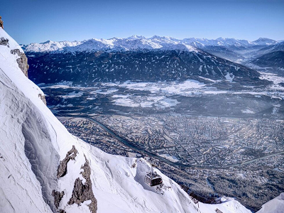
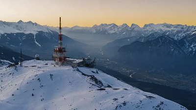
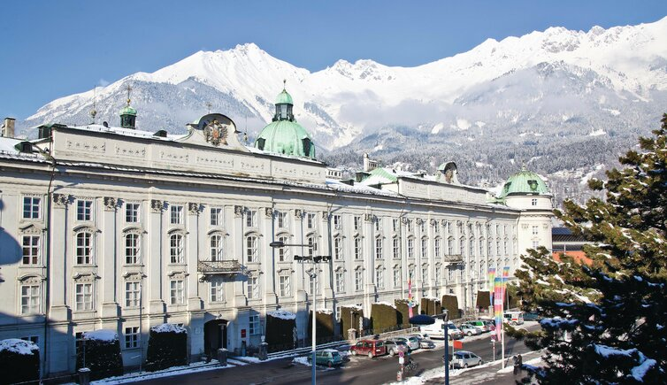
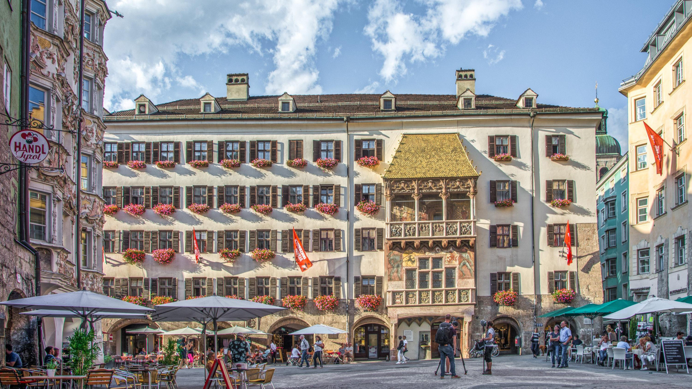
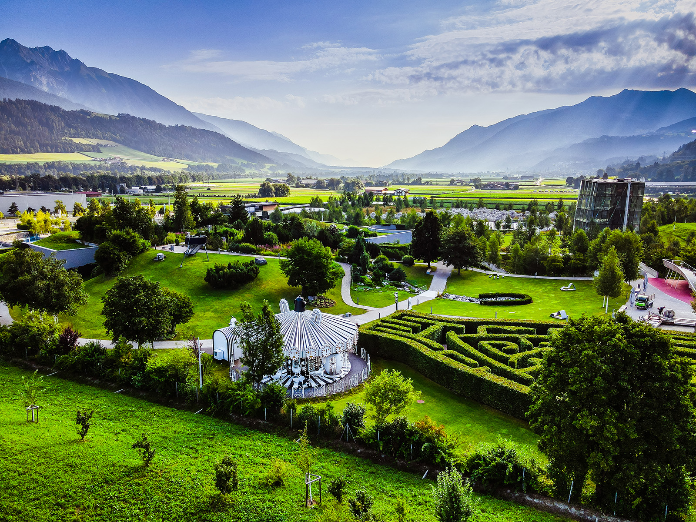

[zurück](../AT.md)

# Innsbruck

| Transport | Dauer | Kosten |
|-----------|--------|---------|
| Auto      | ca. 3,5 h (ca. 300 km via DE/AT) | Maut AT: ca. CHF 10 (10-Tage) |
| Zug       | ca. 4-5 h | ca. CHF 50-80 |

### Unterkunftskosten
- **Günstige Hostels/Pensionen:** ab ca. CHF 60/Nacht  
- **Mittelklasse-Hotels:** ab ca. CHF 100/Nacht

### Kulinarische Empfehlungen
- Tiroler Spezialitäten (z. B. Tiroler Gröstl, Speckknödel, Kaiserschmarrn)  
- Lokale Biere (Stiegl, Zillertal Bier)  
- Regionale Almprodukte (Käse, Butter)

### Reisezeitempfehlung
- **Frühling/Herbst:** Angenehme Temperaturen, weniger Touristen  
- **Sommer:** Perfekt für Outdoor-Aktivitäten: Wandern und Mountainbiken  
- **Winter:** Weihnachtsmärkte, Skifahren

---

# Aktivitäten

## Historische Sehenswürdigkeiten
- **Hofburg Innsbruck:**  
  Ehemalige Residenz der Habsburger, barocke Prunksäle, Eintritt ab ca. CHF 10-15.
  
- **Goldenes Dachl:**  
  Wahrzeichen der Stadt in der Altstadt, spätgotischer Erker mit vergoldeten Schindeln. Kostenlos von aussen zu bewundern.
  
- **Hofkirche & Kaiserliche Hofburgkapelle:**  
  Gotische Kirche mit Schwarzen Mander (Bronzestatuen), Eintritt ca. CHF 8-10.

## Regionale Denkmäler & Gedenkstätten
- **Andreas-Hofer-Denkmal:**  
  Gewidmet dem Tiroler Freiheitskämpfer Andreas Hofer, der Anfang des 19. Jahrhunderts für die Unabhängigkeit Tirols kämpfte. Das Denkmal steht für den Stolz und die Identität der Region.

- **Rudolfsbrunnen:**  
  Ein historischer Brunnen auf dem Landhausplatz, errichtet zu Ehren von Erzherzog Rudolf. Er ist ein Beispiel für die lange Habsburger Tradition und Geschichte der Stadt.

## Andere Ausflüge
- **Swarovski Kristallwelten (Wattens):**  
  Ca. 20 Min. Fahrt, Eintritt ca. CHF 20.
  
- **Hall in Tirol:**  
  Ca. 15 Min. Fahrt, mittelalterliche Altstadt, Münzerturm, Eintritt im Museum ca. CHF 8-10.
  
- **Bergisel-Schanze & Museum:**  
  In Innsbruck, moderne Skisprungschanze mit Panoramablick, Eintritt ca. CHF 10.

## Sommeraktivitäten
- **Wandern auf der Nordkette:**  
  Seilbahn ab ca. CHF 35-40, Bergpanoramen, zahlreiche Wanderwege.
  
- **Fahrradtour entlang des Inn:**  
  Radverleih ab ca. CHF 15/Tag, flache Strecke durch das Inntal.
  
- **Baden im Baggersee Rossau:**  
  Günstiger Eintritt.

## Winteraktivitäten
- **Weihnachtsmarkt in der Altstadt (Dezember):**  
  Kostenloser Zutritt, Glühwein, Handwerkskunst, festliche Atmosphäre.
  
- **Skifahren auf der Nordkette oder Patscherkofel:**  
  Skipässe ab ca. CHF 40-60/Tag.
  
- **Museum Ferdinandeum:**  
  Eintritt ca. CHF 10-15, Kunst- und Kulturgeschichte Tirols.

## Wanderungen in der Region

### Wanderung auf die Nordkette
**Beschreibung:**  
Ab der Hungerburg (mit der Standseilbahn erreichbar) wandert man auf gut ausgeschilderten Wegen durch alpine Landschaften. Almen und Hütten für die Verpflegung.

**Länge & Dauer:**  
Je nach Route 5-10 km, 2-4 Stunden Gehzeit.

**Highlights:**  
Spektakulärer Blick über Innsbruck und das Inntal, alpine Flora und Fauna.

**Weitere Infos:** [Wanderung Nordkette](https://www.innsbruck.info)

### Wanderung Patscherkofel
**Beschreibung:**  
Der Hausberg Innsbrucks ist per Seilbahn erreichbar. Von der Bergstation aus einfache bis mittelschwere Wanderungen durch Lärchenwälder mit Panoramablick.

**Länge & Dauer:**  
Ca. 4-8 km Rundwege, 2-3 Stunden Gehzeit.

**Highlights:**  
Aussicht auf die Stubaier Alpen, alpine Vegetation, Einkehrmöglichkeit auf Hütten.

**Weitere Infos:** [Patscherkofel Wandern](https://www.innsbruck.info)

---

# Fotos
**Altstadt**  

**Hofburg**  

**Goldenes Dachl**  

**Swarovski Kristallwelten**  

